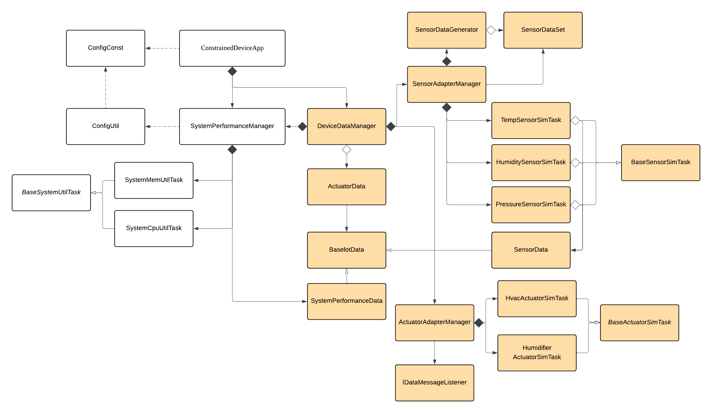

# Constrained Device Application (Connected Devices)

## Lab Module 03

Be sure to implement all the PIOT-CDA-\* issues (requirements) listed at [PIOT-INF-03-001 - Lab Module 03](https://github.com/orgs/programming-the-iot/projects/1#column-10488379).

### Description

NOTE: Include two full paragraphs describing your implementation approach by answering the questions listed below.

What does your implementation do?

In this module, I aim to simulate my local closed-loop CDA flow that simulates sensor telemetry, performs basic local decisioning, and drives simulated actuation. It periodically generates environmental readings (humidity, pressure, temperature) and system performance metrics (CPU, memory), routes them through the same message pipeline, and can issue ActuatorData commands, for now we have HVAC and humidifier, that execute in actuator simulators and return updated actuator state as response data.

How does your implementation work?

Sensor simulator tasks extend BaseSensorSimTask to generate bounded values that could be random number or dataset-based value, and SensorAdapterManager runs them on a fixed schedule by calling handleTelemetry() and forwarding the resulting messages through IDataMessageListener.

On the actuation path, actuator simulator tasks extend BaseActuatorSimTask to reuse the standard activate/deactivate lifecycle, and ActuatorAdapterManager acts as the control gate by validating commands before routing them to the correct actuator. DeviceDataManager sits in the middle to aggregate sensor, system performance, and actuator messages, perform simple local decisioning.

### Code Repository and Branch

NOTE: Be sure to include the branch (e.g. https://github.com/programming-the-iot/python-components/tree/alpha001).

URL: https://github.com/TELE6530-spring2026-WEICHENG/cda-python-components/tree/lab3

### UML Design Diagram(s)

NOTE: Include one or more UML designs representing your solution. It's expected each
diagram you provide will look similar to, but not the same as, its counterpart in the
book [Programming the IoT](https://learning.oreilly.com/library/view/programming-the-internet/9781492081401/).

### Unit Tests Executed

NOTE: TA's will execute your unit tests. You only need to list each test case below
(e.g. ConfigUtilTest, DataUtilTest, etc). Be sure to include all previous tests, too,
since you need to ensure you haven't introduced regressions.

- test_ConfigUtilDefault
- test_ConfigUtilCustom
- test_SystemCpuUtilTask
- test_SystemMemUtilTask
- test_ActuatorData
- test_SensorData
- test_SystemPerformanceData
- test_HumiditySensorSimTask
- test_PressureSensorSimTask
- test_TemperatureSensorSimTask
- test_HumidifierActuatorSimTask
- test_HvacActuatorSimTask

### Integration Tests Executed

NOTE: TA's will execute most of your integration tests using their own environment, with
some exceptions (such as your cloud connectivity tests). In such cases, they'll review
your code to ensure it's correct. As for the tests you execute, you only need to list each
test case below (e.g. SensorSimAdapterManagerTest, DeviceDataManagerTest, etc.)

- test_ConstrainedDeviceApp
- test_SystemPerformanceManager
- test_SensorAdapterManager
- test_ActuatorAdapterManager
- test_DeviceDataManagerNoComms

EOF.
