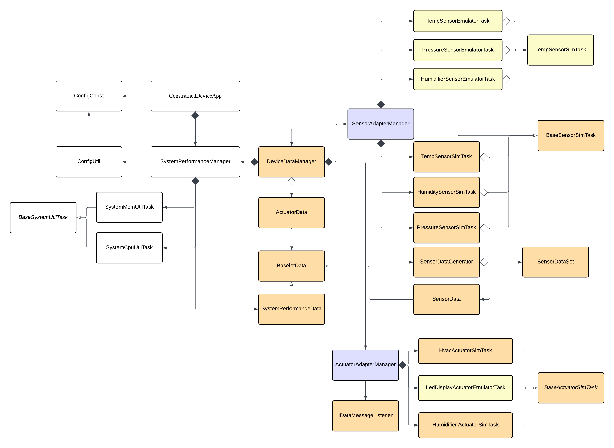

# Constrained Device Application (Connected Devices)

## Lab Module 04

Be sure to implement all the PIOT-CDA-\* issues (requirements) listed at [PIOT-INF-04-001 - Lab Module 04](https://github.com/orgs/programming-the-iot/projects/1#column-10488386).

### Description

NOTE: Include two full paragraphs describing your implementation approach by answering the questions listed below.

What does your implementation do?

In this module, the adding functions upgrade the CDA from pure simulation into a configurable emulation pipeline. When emulation is enabled, the CDA reads real-time environmental values, including humidity, pressure, and temperature from the Sense HAT emulator and pushes them through the same message flow used in Module 03. On the actuation side, the CDA can execute actuator commands using emulator-backed actuator tasks, allowing commands such as HVAC, humidifier, and LED display when present to surface as visible behavior on the emulator’s LED matrix. To sum up, it keeps the same end-to-end closed-loop structure as previous module, but swaps the data source from generated datasets into a hardware-like emulator so the system behaves closer to a real edge device.

How does your implementation work?

The core mechanism is a config-driven switch in ConstrainedDevice.enableEmulator that determines whether Managers wire up simulator tasks or emulator tasks at runtime. `SensorAdapterManager` and `ActuatorAdapterManager` read the emulator flag via `ConfigUtil`. Emulator sensor tasks inherit from `BaseSensorSimTask`, instantiate `SenseHAT(emulate=<flag>)`, and implement `generateTelemetry()` by reading `sh.environ.{humidity|pressure|temperature}` and returning `SensorData` object. Emulator actuator tasks inherit from `BaseActuatorSimTask`, reuse the same activate/deactivate state flow, and override `_activateActuator()` / `_deactivateActuator()` to drive the Sense HAT LED display. Because the Managers keep the same `handleTelemetry()` and command dispatch surfaces, `DeviceDataManager` can continue to orchestrate messages and local decisioning without refactoring—only the pluggable Tasks change.

### Code Repository and Branch

NOTE: Be sure to include the branch (e.g. https://github.com/programming-the-iot/python-components/tree/alpha001).

URL: https://github.com/TELE6530-spring2026-WEICHENG/cda-python-components/tree/lab4

### UML Design Diagram(s)

NOTE: Include one or more UML designs representing your solution. It's expected each
diagram you provide will look similar to, but not the same as, its counterpart in the
book [Programming the IoT](https://learning.oreilly.com/library/view/programming-the-internet/9781492081401/).

### Unit Tests Executed

NOTE: TA's will execute your unit tests. You only need to list each test case below
(e.g. ConfigUtilTest, DataUtilTest, etc). Be sure to include all previous tests, too,
since you need to ensure you haven't introduced regressions.

- test_ConfigUtilDefault
- test_ConfigUtilCustom
- test_SystemCpuUtilTask
- test_SystemMemUtilTask
- test_ActuatorData
- test_SensorData
- test_SystemPerformanceData
- test_HumiditySensorSimTask
- test_PressureSensorSimTask
- test_TemperatureSensorSimTask
- test_HumidifierActuatorSimTask
- test_HvacActuatorSimTask

### Integration Tests Executed

NOTE: TA's will execute most of your integration tests using their own environment, with
some exceptions (such as your cloud connectivity tests). In such cases, they'll review
your code to ensure it's correct. As for the tests you execute, you only need to list each
test case below (e.g. SensorSimAdapterManagerTest, DeviceDataManagerTest, etc.)

- test_ConstrainedDeviceApp
- test_SystemPerformanceManager
- test_SensorAdapterManager
- test_ActuatorAdapterManager
- test_DeviceDataManagerNoComms
- test_SenseHatEmulatorQuickTest
- test_HumidityEmulatorTask
- test_PressureEmulatorTask
- test_TemperatureEmulatorTask
- test_HumidifierEmulatorTask
- test_HvacEmulatorTask
- test_LedDisplayEmulatorTask
- test_SensorEmulatorManager
- test_ActuatorEmulatorManager
  EOF.
