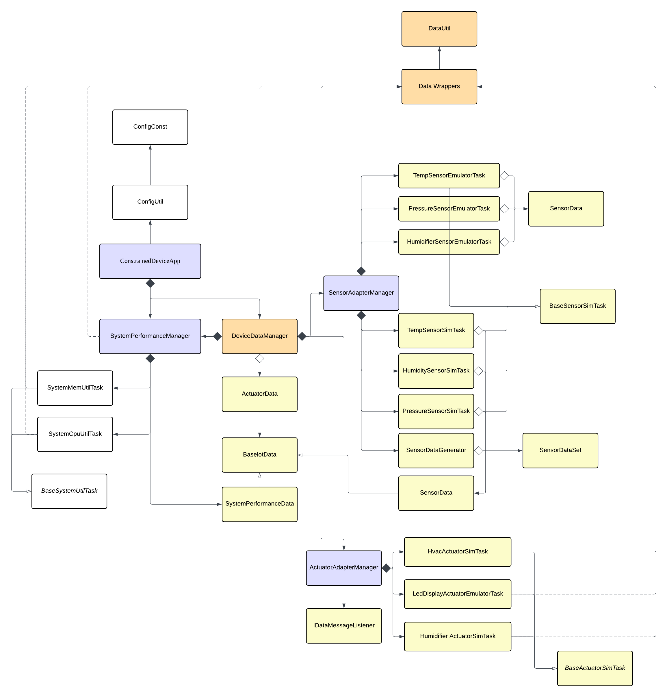

# Constrained Device Application (Connected Devices)

## Lab Module 05

Be sure to implement all the PIOT-CDA-\* issues (requirements) listed at [PIOT-INF-05-001 - Lab Module 05](https://github.com/orgs/programming-the-iot/projects/1#column-10488421).

### Description

NOTE: Include two full paragraphs describing your implementation approach by answering the questions listed below.

What does your implementation do?

SystemPerformanceManager Update: The implementation enhances the SystemPerformanceManager to go beyond simply logging CPU and memory utilization values. It now packages the collected telemetry into a SystemPerformanceData object and delivers it upstream to the DeviceDataManager through the IDataMessageListener callback interface. This integrates system performance data into the application's data pipeline, making it available for JSON serialization, network transmission, and persistent storage.

DataUtil Implementation: The implementation provides a utility class that handles bidirectional conversion between IoT data objects (ActuatorData, SensorData, SystemPerformanceData) and JSON strings. This is the foundational serialization layer required for CDA-to-GDA communication, as data must be converted to a common format before it can be transmitted over MQTT or CoAP.

How does your implementation work?

SystemPerformanceManager is periodically triggered by APScheduler to run handleTelemetry(), which calls getTelemetryValue() on SystemCpuUtilTask and SystemMemUtilTask, then creates a SystemPerformanceData object, fills it with the location ID plus CPU and memory utilization, and forwards it to DeviceDataManager via the registered callback dataMsgListener.handleSystemPerformanceMessage(). In parallel, DataUtil provides bidirectional JSON serialization: for object-to-JSON it uses json.dumps() with a custom JsonDataEncoder whose default() returns the object’s **dict**, and for JSON-to-object it normalizes the input string (single to double quotes and boolean casing), parses it using json.loads(), instantiates the target class, then uses reflection (vars() and setattr()) to map dictionary keys onto object attributes; the shared logic is centralized in \_generateJsonData() and \_updateIotData() to avoid duplication across data types.

### Code Repository and Branch

NOTE: Be sure to include the branch (e.g. https://github.com/programming-the-iot/python-components/tree/alpha001).

URL:https://github.com/TELE6530-spring2026-WEICHENG/cda-python-components/tree/lab5

### UML Design Diagram(s)

NOTE: Include one or more UML designs representing your solution. It's expected each
diagram you provide will look similar to, but not the same as, its counterpart in the
book [Programming the IoT](https://learning.oreilly.com/library/view/programming-the-internet/9781492081401/).

### Unit Tests Executed

NOTE: TA's will execute your unit tests. You only need to list each test case below
(e.g. ConfigUtilTest, DataUtilTest, etc). Be sure to include all previous tests, too,
since you need to ensure you haven't introduced regressions.

- test_ConfigUtilDefault
- test_ConfigUtilCustom
- test_SystemCpuUtilTask
- test_SystemMemUtilTask
- test_ActuatorData
- test_SensorData
- test_SystemPerformanceData
- test_HumiditySensorSimTask
- test_PressureSensorSimTask
- test_TemperatureSensorSimTask
- test_HumidifierActuatorSimTask
- test_HvacActuatorSimTask

### Integration Tests Executed

NOTE: TA's will execute most of your integration tests using their own environment, with
some exceptions (such as your cloud connectivity tests). In such cases, they'll review
your code to ensure it's correct. As for the tests you execute, you only need to list each
test case below (e.g. SensorSimAdapterManagerTest, DeviceDataManagerTest, etc.)

- test_ConstrainedDeviceApp
- test_SystemPerformanceManager
- test_SensorAdapterManager
- test_ActuatorAdapterManager
- test_DeviceDataManagerNoComms
- test_SenseHatEmulatorQuickTest
- test_HumidityEmulatorTask
- test_PressureEmulatorTask
- test_TemperatureEmulatorTask
- test_HumidifierEmulatorTask
- test_HvacEmulatorTask
- test_LedDisplayEmulatorTask
- test_SensorEmulatorManager
- test_ActuatorEmulatorManager
- test_SystemPerformanceManager
- test_DataIntegrationTest

EOF.
