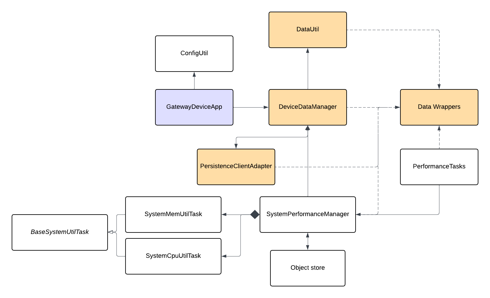

# Gateway Device Application (Connected Devices)

## Lab Module 05

Be sure to implement all the PIOT-GDA-\* issues (requirements) listed at [PIOT-INF-05-001 - Lab Module 05](https://github.com/orgs/programming-the-iot/projects/1#column-10488421).

### Description

NOTE: Include two full paragraphs describing your implementation approach by answering the questions listed below.

What does your implementation do?

My Lab 5 implementation builds the GDA’s data infrastructure layer by introducing a consistent set of IoT data container classes (ActuatorData, SensorData, SystemPerformanceData, and optionally SystemStateData) that all extend BaseIotData and package telemetry/commands with shared metadata (name, timestamp, type ID, location ID, status code), adding a DataUtil singleton that uses Gson to serialize/deserialize these containers to JSON for CDA interoperability and future services, enhancing SystemPerformanceManager to collect CPU/memory/disk telemetry into SystemPerformanceData and forward it via an IDataMessageListener callback when registered, and establishing DeviceDataManager as the GDA’s central coordinator that implements IDataMessageListener to receive and route all message types while managing the lifecycle of SystemPerformanceManager and future clients (MQTT/CoAP/cloud/persistence), with GatewayDeviceApp updated to orchestrate everything through DeviceDataManager instead of talking to SystemPerformanceManager directly.

How does your implementation work?

The implementation uses a layered, callback-driven flow: at the data container layer, all message types extend BaseIotData to share core metadata, including name, typeID, statusCode, timestamp, locationID, and a template-style handleUpdateData(), while each subclass adds its own fields and updates timestamps on setter calls to track the latest change, with naming aligned to the CDA models for clean JSON mapping.

For serialization, a DataUtil singleton wraps Gson toJson() / fromJson() into type-specific helpers, which are actuatorDataToJson() and jsonToActuatorData(), repeated consistently across all data types. For system telemetry, SystemPerformanceManager schedules handleTelemetry() via ScheduledExecutorService, collects CPU via ManagementFactory, JVM heap memory percentage, and disk usage, packages them into a new SystemPerformanceData with the configured location ID, and pushes it upstream through IDataMessageListener.handleSystemPerformanceMessage().

DeviceDataManager is the central hub: it implements IDataMessageListener, reads config enablement flags, initializes required sub-managers in initManager(), registers itself as the listener for SystemPerformanceManager, and starts/stops everything through startManager() / stopManager(), where incoming performance data can be logged and optionally serialized for upstream transport.

Finally, GatewayDeviceApp acts as the entry point that instantiates DeviceDataManager, calls startManager() on startup and stopManager() on shutdown, and supports both a timed test run and a run-forever mode driven by configuration.

### Code Repository and Branch

NOTE: Be sure to include the branch (e.g. https://github.com/programming-the-iot/python-components/tree/alpha001).

URL: https://github.com/TELE6530-spring2026-WEICHENG/gda-java-components/tree/lab5

### UML Design Diagram(s)

NOTE: Include one or more UML designs representing your solution. It's expected each
diagram you provide will look similar to, but not the same as, its counterpart in the
book [Programming the IoT](https://learning.oreilly.com/library/view/programming-the-internet/9781492081401/).

### Unit Tests Executed

NOTE: TA's will execute your unit tests. You only need to list each test case below
(e.g. ConfigUtilTest, DataUtilTest, etc). Be sure to include all previous tests, too,
since you need to ensure you haven't introduced regressions.

- ConfigUtilDefaultTest
- ConfigUtilCustomTest
- SystemCpuUtilTaskTest
- SystemMemUtilTaskTest
- ActuatorDataTest
- SensorDataTest
- SystemPerformanceDataTest

### Integration Tests Executed

NOTE: TA's will execute most of your integration tests using their own environment, with
some exceptions (such as your cloud connectivity tests). In such cases, they'll review
your code to ensure it's correct. As for the tests you execute, you only need to list each
test case below (e.g. SensorSimAdapterManagerTest, DeviceDataManagerTest, etc.)

- SystemPerformanceManagerTest
- GatewayDeviceAppTest
- SystemPerformanceManagerTest
- DataIntegrationTest
- DeviceDataManagerNoCommsTest
- GatewayDeviceAppTest

EOF.
