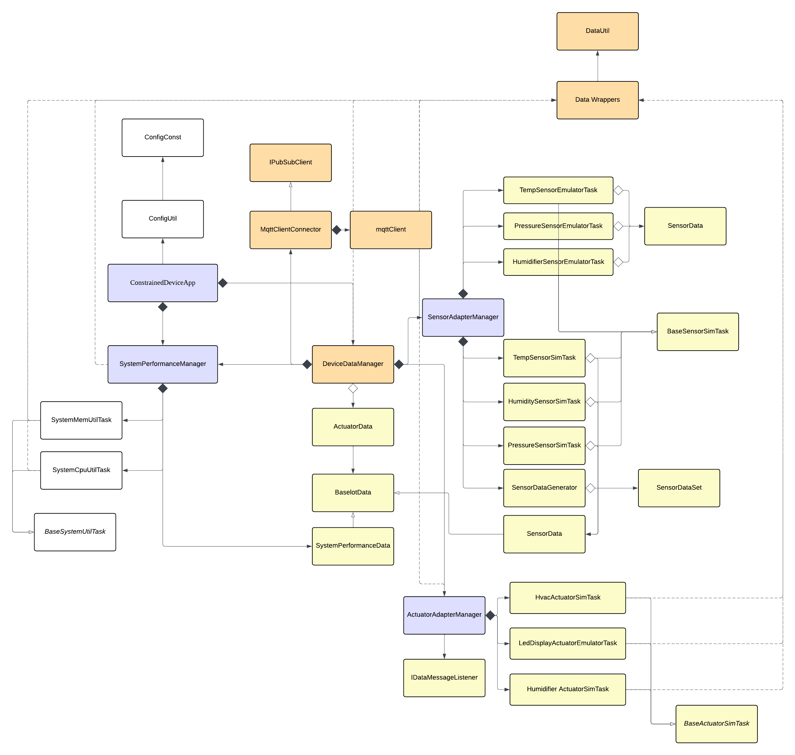

# Constrained Device Application (Connected Devices)

## Lab Module 06

Be sure to implement all the PIOT-CDA-\* issues (requirements) listed at [PIOT-INF-06-001 - Lab Module 06](https://github.com/orgs/programming-the-iot/projects/1#column-10488434).

### Description

NOTE: Include two full paragraphs describing your implementation approach by answering the questions listed below.

What does your implementation do?

In this lab module, I create a MQTT client in CDA that is able to connect to our MQTT broker. Create functions like connect/disconnect to broker, publish message to designated topic, and subscribe/unsubscribe a topic, enabling sending and receiving data from GDA through MQTT protocol.

How does your implementation work?

In MqttClientConnector class, a MqttClient wrapper, we have some critical functions that allow CDA to communicate with MQTT broker. We have three main types of MQTT functionality: connecting functions connectClient()and disconnectClient(), sending message function publishMessage(), topic subscription functions subscribeToTopic() and unsubscribeFromTopic(), which are basically input checker and implement Paho library API to do the real MQTT functionality. Apart from them, MqttClientConnector also need to manually define callback functions and assign those to MqttClient object. Finally, we initiate MqttClientConnector object in DeviceDataManager as one of manages in CDA life cycle.

### Code Repository and Branch

NOTE: Be sure to include the branch (e.g. https://github.com/programming-the-iot/python-components/tree/alpha001).

URL: https://github.com/TELE6530-spring2026-WEICHENG/cda-python-components/tree/lab6

### UML Design Diagram(s)

NOTE: Include one or more UML designs representing your solution. It's expected each
diagram you provide will look similar to, but not the same as, its counterpart in the
book [Programming the IoT](https://learning.oreilly.com/library/view/programming-the-internet/9781492081401/).

### Unit Tests Executed

NOTE: TA's will execute your unit tests. You only need to list each test case below
(e.g. ConfigUtilTest, DataUtilTest, etc). Be sure to include all previous tests, too,
since you need to ensure you haven't introduced regressions.

- test_ConfigUtilDefault
- test_ConfigUtilCustom
- test_SystemCpuUtilTask
- test_SystemMemUtilTask
- test_ActuatorData
- test_SensorData
- test_SystemPerformanceData
- test_HumiditySensorSimTask
- test_PressureSensorSimTask
- test_TemperatureSensorSimTask
- test_HumidifierActuatorSimTask
- test_HvacActuatorSimTask

### Integration Tests Executed

NOTE: TA's will execute most of your integration tests using their own environment, with
some exceptions (such as your cloud connectivity tests). In such cases, they'll review
your code to ensure it's correct. As for the tests you execute, you only need to list each
test case below (e.g. SensorSimAdapterManagerTest, DeviceDataManagerTest, etc.)

- test_ConstrainedDeviceApp
- test_SystemPerformanceManager
- test_SensorAdapterManager
- test_ActuatorAdapterManager
- test_DeviceDataManagerNoComms
- test_SenseHatEmulatorQuickTest
- test_HumidityEmulatorTask
- test_PressureEmulatorTask
- test_TemperatureEmulatorTask
- test_HumidifierEmulatorTask
- test_HvacEmulatorTask
- test_LedDisplayEmulatorTask
- test_SensorEmulatorManager
- test_ActuatorEmulatorManager
- test_SystemPerformanceManager
- test_DataIntegrationTest

---

- testConnectAndDisconnect() in test_MqttClientConnector
- testConnectAndCDAManagementStatusPubSub() in test_MqttClientConnector
- testActuatorCmdPubSub() in test_MqttClientConnector
- Publish and subscribe integration test - using two terminal

  EOF.
