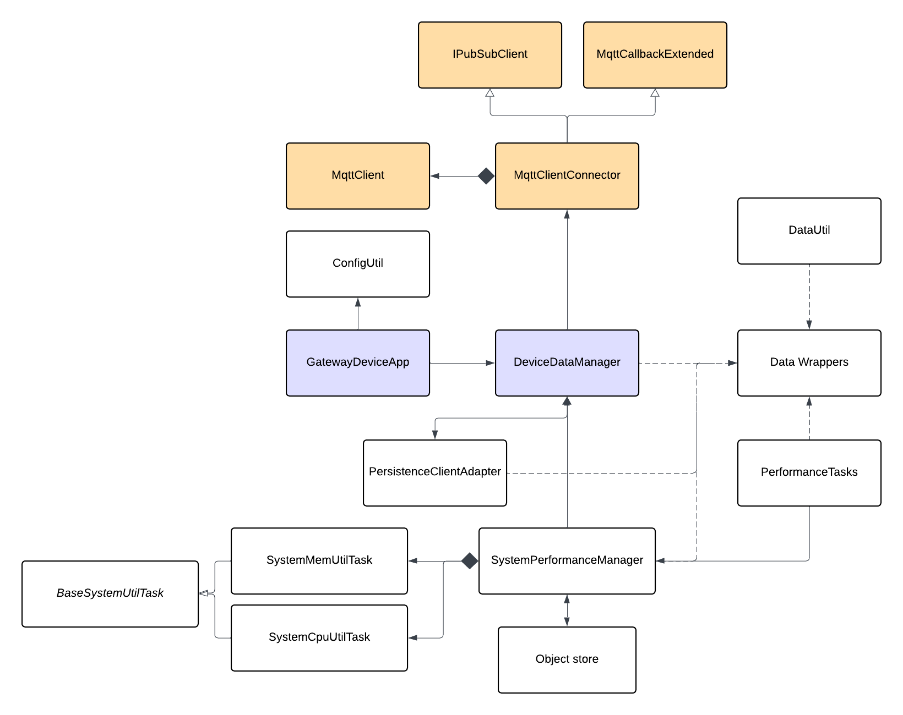

# Gateway Device Application (Connected Devices)

## Lab Module 07

Be sure to implement all the PIOT-GDA-\* issues (requirements) listed at [PIOT-INF-07-001 - Lab Module 07](https://github.com/orgs/programming-the-iot/projects/1#column-10488499).

### Description

NOTE: Include two full paragraphs describing your implementation approach by answering the questions listed below.

What does your implementation do?

In this lab module, I create a MQTT client in GDA that is able to connect to our MQTT broker. Create functions like connect/disconnect to broker, publish message to designated topic, and subscribe/unsubscribe a topic, enabling receiving data from CDA through MQTT protocol.

How does your implementation work?

In MqttClientConnector class, a MqttClient wrapper, we have some critical functions that allow GDA to communicate with MQTT broker. We have connectClient(), disconnectClient(), publishMessage(), subscribeToTopic(), and unsubscribeFromTopic(), which are basically input checker and implement Paho library API to do the real MQTT functionality. Apart from them, MqttClientConnector also implement MqttCallbackExtended class which defines callback functions that will be used by MqttClient. By using this observer design pattern, MqttClient doesn't need to know what exactly the listener class is, but can use those callback functions directly.

### Code Repository and Branch

NOTE: Be sure to include the branch (e.g. https://github.com/programming-the-iot/python-components/tree/alpha001).

URL: https://github.com/TELE6530-spring2026-WEICHENG/gda-java-components/tree/lab7

### UML Design Diagram(s)

NOTE: Include one or more UML designs representing your solution. It's expected each
diagram you provide will look similar to, but not the same as, its counterpart in the
book [Programming the IoT](https://learning.oreilly.com/library/view/programming-the-internet/9781492081401/).

### Unit Tests Executed

NOTE: TA's will execute your unit tests. You only need to list each test case below
(e.g. ConfigUtilTest, DataUtilTest, etc). Be sure to include all previous tests, too,
since you need to ensure you haven't introduced regressions.

- ConfigUtilDefaultTest
- ConfigUtilCustomTest
- SystemCpuUtilTaskTest
- SystemMemUtilTaskTest
- ActuatorDataTest
- SensorDataTest
- SystemPerformanceDataTest

### Integration Tests Executed

NOTE: TA's will execute most of your integration tests using their own environment, with
some exceptions (such as your cloud connectivity tests). In such cases, they'll review
your code to ensure it's correct. As for the tests you execute, you only need to list each
test case below (e.g. SensorSimAdapterManagerTest, DeviceDataManagerTest, etc.)

- SystemPerformanceManagerTest
- GatewayDeviceAppTest
- SystemPerformanceManagerTest
- DataIntegrationTest
- DeviceDataManagerNoCommsTest
- GatewayDeviceAppTest

---

- testConnectAndDisconnect() in MqttClientConnectorTest
- testPublishAndSubscribe() in MqttClientConnectorTest
- MqttClientControlPacketTest
- Publish and subscribe integration test - using two terminal

EOF.
