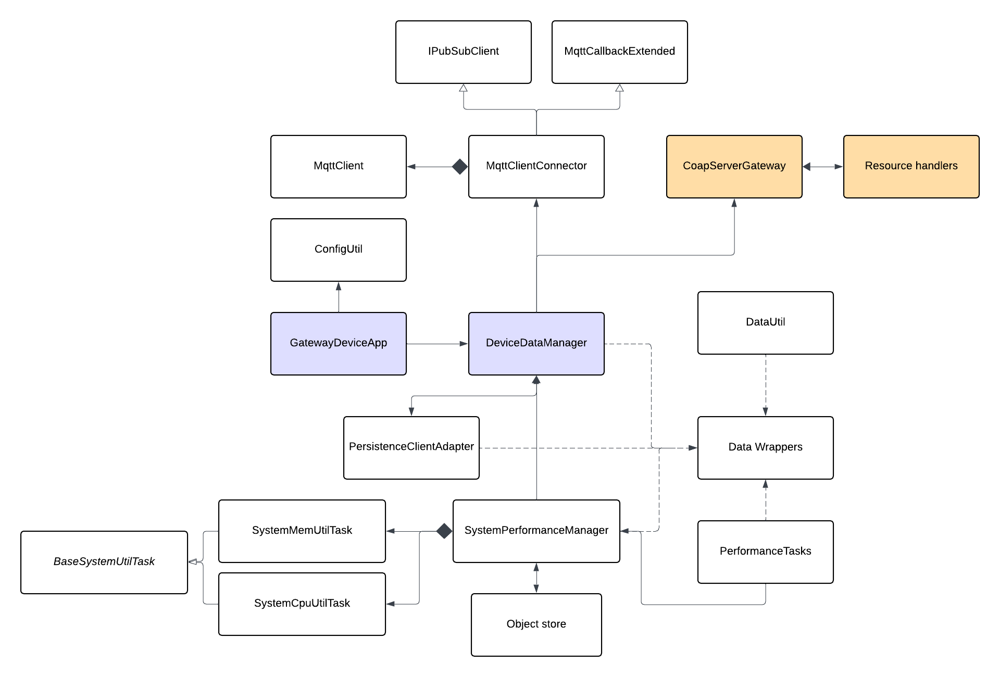

# Gateway Device Application (Connected Devices)

## Lab Module 08

Be sure to implement all the PIOT-GDA-\* issues (requirements) listed at [PIOT-INF-08-001 - Lab Module 08](https://github.com/orgs/programming-the-iot/projects/1#column-10488501).

### Description

NOTE: Include two full paragraphs describing your implementation approach by answering the questions listed below.

What does your implementation do?

In this module, I add a fully functional CoAP server to the GDA that the CDA can push sensor and system-performance data to via PUT, and pull actuator commands from via GET with OBSERVE mechanism. The server registers a hierarchical URI resource tree, deduplicates incoming data using Redis, forwards valid data upstream through DeviceDataManager, and pushes actuator commands back to subscribed CDA clients automatically.

How does your implementation work?
DeviceDataManager reads an enableCoapServer flag from config and, if set, instantiates CoapServerGateway, passing itself as the IDataMessageListener. On construction, CoapServerGateway creates a Californium CoapServer on the configured UDP port, then iterates all ResourceNameEnum values and builds a tree of URI segments, the leaf node gets a typed handler which are UpdateSystemPerformanceResourceHandler, UpdateTelemetryResourceHandler, or GetActuatorCommandResourceHandler. The PUT handlers accept JSON from the CDA, deserialize it with DataUtil, check for duplicates via RedisPersistenceAdapter, and on a new record call the appropriate IDataMessageListener callback on DeviceDataManager. GetActuatorCommandResourceHandler works in the opposite direction: it implements IActuatorDataListener, so when DeviceDataManager calls onActuatorDataUpdate() with a new command, the handler merges the data and calls super.changed() which Californium automatically notifies all CDA clients currently observing that resource.

### Code Repository and Branch

NOTE: Be sure to include the branch (e.g. https://github.com/programming-the-iot/python-components/tree/alpha001).

URL: https://github.com/TELE6530-spring2026-WEICHENG/gda-java-components/tree/lab8

### UML Design Diagram(s)

NOTE: Include one or more UML designs representing your solution. It's expected each
diagram you provide will look similar to, but not the same as, its counterpart in the
book [Programming the IoT](https://learning.oreilly.com/library/view/programming-the-internet/9781492081401/).

### Unit Tests Executed

NOTE: TA's will execute your unit tests. You only need to list each test case below
(e.g. ConfigUtilTest, DataUtilTest, etc). Be sure to include all previous tests, too,
since you need to ensure you haven't introduced regressions.

- ConfigUtilDefaultTest
- ConfigUtilCustomTest
- SystemCpuUtilTaskTest
- SystemMemUtilTaskTest
- ActuatorDataTest
- SensorDataTest
- SystemPerformanceDataTest

### Integration Tests Executed

NOTE: TA's will execute most of your integration tests using their own environment, with
some exceptions (such as your cloud connectivity tests). In such cases, they'll review
your code to ensure it's correct. As for the tests you execute, you only need to list each
test case below (e.g. SensorSimAdapterManagerTest, DeviceDataManagerTest, etc.)

- SystemPerformanceManagerTest
- GatewayDeviceAppTest
- SystemPerformanceManagerTest
- DataIntegrationTest
- DeviceDataManagerNoCommsTest
- GatewayDeviceAppTest

---

- testConnectAndDisconnect() in MqttClientConnectorTest
- testPublishAndSubscribe() in MqttClientConnectorTest
- MqttClientControlPacketTest
- Publish and subscribe integration test - using two terminal

---

- CoapServerGatewayTest
- CoapClientToServerConnectorTest
- CoapClientConnectorTest

EOF.
