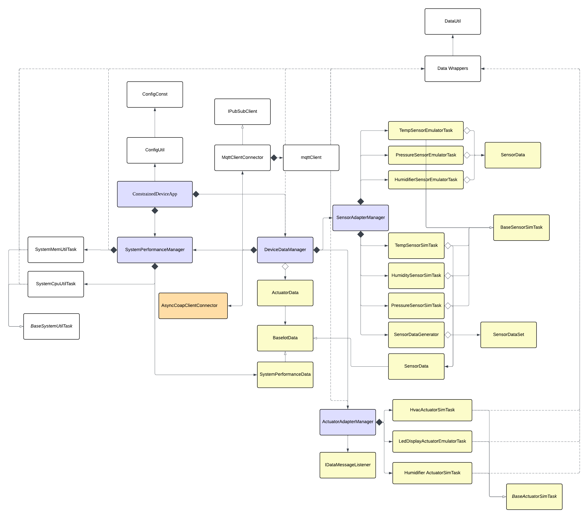

# Constrained Device Application (Connected Devices)

## Lab Module 10

Be sure to implement all the PIOT-CDA-\* issues (requirements) listed at [PIOT-INF-10-001 - Lab Module 10](https://github.com/orgs/programming-the-iot/projects/1#column-10488510).

### Description

NOTE: Include two full paragraphs describing your implementation approach by answering the questions listed below.

What does your implementation do?

TLS Encryption: The MqttClientConnector now supports TLS-encrypted MQTT connections, ensuring all traffic between the CDA and broker is encrypted in transit and unreadable by third parties.

MQTT QoS Performance Test: Benchmarks 10,000 publish operations across QoS 0, 1, and 2 to quantify the latency tradeoff between delivery reliability and throughput.

CoAP CON/NON Performance Test: Benchmarks 10,000 CoAP POST requests in both CON and NON modes to document the reliability-versus-speed tradeoff.

ActuatorData Subscription: The CDA now receives and executes ActuatorData commands sent from the GDA over MQTT, enabling bidirectional control between the two devices.

Upstream Transmission: The CDA now actively pushes sensor readings and system performance metrics to the GDA after each local processing cycle.

How does your implementation work?

When enableCrypt = True, connectClient() loads the CA certificate via Python's ssl module, calls tls_set() with the PEM path, and switches the target port to 8883. For the MQTT QoS performance test, each test method calls \_execTestPublish() with a fixed QoS level, publishing 10,000 SensorData JSON payloads and measuring total elapsed time via time.time_ns() /  
NS_IN_MILLIS. For the CoAP performance test, each method calls \_execTestPost() with enableCON=True/False, sending 10,000 POST requests through AsyncCoapClientConnector and recording elapsed time the same way. For ActuatorData subscription, onConnect() subscribes to CDA_ACTUATOR_CMD_RESOURCE and registers onActuatorCommandMessage via message_callback_add();
when a message arrives, the callback decodes the UTF-8 payload, deserializes it into an ActuatorData object via DataUtil, and forwards it to DeviceDataManager.handleActuatorCommandMessage(), which delegates to ActuatorAdapterManager —
wait_for_publish() is removed from publishMessage() to prevent deadlock when a response publish
is triggered inside the callback. Finally, after local threshold analysis,
handleSensorMessage() and handleSystemPerformanceMessage() serialize their data to JSON via
DataUtil and call \_handleUpstreamTransmission(), which routes the message through
mqttClient.publishMessage() and/or coapClient.sendPutRequest() depending on which connections are enabled in configuration.

## MQTT QoS Performance Test

**Broker:** Mosquitto (localhost:1883, TLS disabled)
**Test file:** `tests/integration/connection/test_MqttClientPerformance.py`

| QoS Level | Description                     | Total Time (ms) | Avg per msg (ms) | vs QoS 0 |
| --------- | ------------------------------- | --------------- | ---------------- | -------- |
| QoS 0     | Fire-and-forget (no ACK)        | 1218.82         | 0.122            | baseline |
| QoS 1     | At-least-once (1 ACK)           | 2350.42         | 0.235            | +92.8%   |
| QoS 2     | Exactly-once (4-step handshake) | 3990.67         | 0.399            | +227.5%  |

**Fastest:** QoS 0 — **Slowest:** QoS 2

### Analysis

QoS 0 is the fastest as it sends messages without waiting for any acknowledgment from the broker. QoS 1 adds a single PUBACK round-trip, roughly doubling the latency compared to QoS 0. QoS 2 requires a four-step handshake (PUBLISH → PUBREC → PUBREL → PUBCOMP), adding the most overhead and taking approximately 3.3x longer than QoS 0. For high-frequency IoT sensor data where occasional message loss is acceptable, QoS 0 provides the best throughput. QoS 2 should be reserved for critical commands such as actuator control where exactly-once delivery is required.

---

## CoAP CON vs NON Performance Test

**Server:** GDA CoAP Server (localhost:5683)
**Test file:** `tests/integration/connection/test_CoapClientPerformance.py`
**Client:** `AsyncCoapClientConnector` (aiocoap, blocking `future.result()` per request)

| Message Type | Description                | Total Time (ms) | Avg per msg (ms) | vs NON   |
| ------------ | -------------------------- | --------------- | ---------------- | -------- |
| NON          | Non-confirmable (no ACK)   | 3037.47         | 0.3037           | baseline |
| CON          | Confirmable (requires ACK) | 3075.28         | 0.3075           | +1.2%    |

---

### Analysis

NON and CON show only a 1.2% difference on localhost, far smaller than the ~5% gap in the reference results. This is expected: on a local loopback network, the ACK round-trip for CON is nearly instantaneous, so the overhead is negligible. In a real wireless IoT network with higher latency and packet loss, the CON penalty would be significantly larger as retransmissions are triggered.

### Code Repository and Branch

NOTE: Be sure to include the branch (e.g. https://github.com/programming-the-iot/python-components/tree/alpha001).

URL:https://github.com/TELE6530-spring2026-WEICHENG/cda-python-components/tree/lab10

### UML Design Diagram(s)

NOTE: Include one or more UML designs representing your solution. It's expected each
diagram you provide will look similar to, but not the same as, its counterpart in the
book [Programming the IoT](https://learning.oreilly.com/library/view/programming-the-internet/9781492081401/).

### Unit Tests Executed

NOTE: TA's will execute your unit tests. You only need to list each test case below
(e.g. ConfigUtilTest, DataUtilTest, etc). Be sure to include all previous tests, too,
since you need to ensure you haven't introduced regressions.

- test_ConfigUtilDefault
- test_ConfigUtilCustom
- test_SystemCpuUtilTask
- test_SystemMemUtilTask
- test_ActuatorData
- test_SensorData
- test_SystemPerformanceData
- test_HumiditySensorSimTask
- test_PressureSensorSimTask
- test_TemperatureSensorSimTask
- test_HumidifierActuatorSimTask
- test_HvacActuatorSimTask

### Integration Tests Executed

NOTE: TA's will execute most of your integration tests using their own environment, with
some exceptions (such as your cloud connectivity tests). In such cases, they'll review
your code to ensure it's correct. As for the tests you execute, you only need to list each
test case below (e.g. SensorSimAdapterManagerTest, DeviceDataManagerTest, etc.)

- test_ConstrainedDeviceApp
- test_SystemPerformanceManager
- test_SensorAdapterManager
- test_ActuatorAdapterManager
- test_DeviceDataManagerNoComms
- test_SenseHatEmulatorQuickTest
- test_HumidityEmulatorTask
- test_PressureEmulatorTask
- test_TemperatureEmulatorTask
- test_HumidifierEmulatorTask
- test_HvacEmulatorTask
- test_LedDisplayEmulatorTask
- test_SensorEmulatorManager
- test_ActuatorEmulatorManager
- test_SystemPerformanceManager
- test_DataIntegrationTest
- testConnectAndDisconnect() in test_MqttClientConnector
- testConnectAndCDAManagementStatusPubSub() in test_MqttClientConnector
- testActuatorCmdPubSub() in test_MqttClientConnector
- Publish and subscribe integration test - using two terminal
- test_CoapAsyncClientConnectorTest

---

- DeviceDataManagerWithCommsTest-testActuatorDataCallback() with enableMqttClient = False
- MqttClientConnectorTest-testActuatorCmdPubSub() with enableCrypt = False
- DeviceDataManagerIntegrationTest-testDeviceDataMgrTimedIntegration() with enableEmulator = True

EOF.
