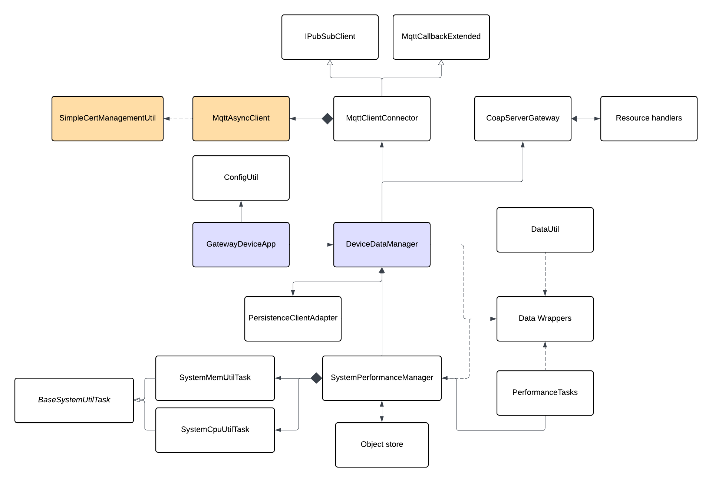

# Gateway Device Application (Connected Devices)

## Lab Module 10

Be sure to implement all the PIOT-GDA-\* issues (requirements) listed at [PIOT-INF-10-001 - Lab Module 10](https://github.com/orgs/programming-the-iot/projects/1#column-10488510).

### Description

NOTE: Include two full paragraphs describing your implementation approach by answering the questions listed below.

What does your implementation do?

In this module, first, I run MQTT performance benchmark to measure publish throughput across QoS 0/1/2 to compare protocol overhead. Second, I secures MQTT communication with TLS by loading a self-host CA certificate to build an SSLSocketFactory. Third, I improve MQTT message routing for avoiding deadlock. Last but not least, I create a threshold-base actuation by analyzing incoming humidity sensor data from CDA based on floor and ceiling threshold and GDA sends actuator commands like humidifier on/off command to CDA via MQTT.

How does your implementation work?

For TLS, initSecureConnectionParameters() calls SimpleCertManagementUtil.loadCertificate(ca.crt), which imports the CA cert into a Java KeyStore, initializes a TrustManagerFactory, creates an SSLContext(TLSv1.2), and returns an SSLSocketFactory. This factory is set on MqttConnectOptions, and the broker address switches to ssl://localhost:8883. Java's SSL engine then automatically verifies the broker's server.crt against the trusted CA during the TLS handshake. And then, initCredentialConnectionParameters() reads username/password from a credential file and sets them on MqttConnectOptions via setUserName()/ setPassword().

For MQTT Message Routing, When messageArrived(topic, message) fires, it checks the topic string and routes to the appropriate IDataMessageListener method — handleSensorMessage() for sensor topics, handleActuatorCommandResponse() for actuator responses, and handleSystemPerformanceMessage() for system performance topics. JSON deserialization is handled by DataUtil.

For DeviceDataManager's analysis and actuation: handleIncomingDataAnalysis() in DeviceDataManager checks humidity values against configurable thresholds. When a threshold is crossed, it creates an ActuatorData command and publishes it to the CDA's actuator command MQTT topic.

# MQTT Performance Test Results (Non-TLS)

## Results

| QoS Level | Description   | Messages | Elapsed (sec) | Throughput (msgs/sec) |
| --------- | ------------- | -------- | ------------- | --------------------- |
| QoS 0     | At most once  | 10,000   | 0.781         | ~12,804               |
| QoS 1     | At least once | 10,000   | 1.766         | ~5,662                |
| QoS 2     | Exactly once  | 10,000   | 3.191         | ~3,134                |

- **QoS 0** is the fastest. It is fire-and-forget with no acknowledgment. The publisher sends the message and moves on, making it ideal for high-frequency, loss-tolerant data like periodic sensor readings.
- **QoS 1** is ~2.3x slower. Since each message requires a PUBACK from the broker, adding one round-trip per message.
- **QoS 2** is ~4.1x slower. It uses a four-step handshake (PUBLISH → PUBREC → PUBREL → PUBCOMP) to guarantee exactly-once delivery. This doubles the round-trips compared to QoS 1, making it the most reliable but slowest option.

### Code Repository and Branch

NOTE: Be sure to include the branch (e.g. https://github.com/programming-the-iot/python-components/tree/alpha001).

URL: https://github.com/TELE6530-spring2026-WEICHENG/gda-java-components/tree/lab10

### UML Design Diagram(s)

NOTE: Include one or more UML designs representing your solution. It's expected each
diagram you provide will look similar to, but not the same as, its counterpart in the
book [Programming the IoT](https://learning.oreilly.com/library/view/programming-the-internet/9781492081401/).

### Unit Tests Executed

NOTE: TA's will execute your unit tests. You only need to list each test case below
(e.g. ConfigUtilTest, DataUtilTest, etc). Be sure to include all previous tests, too,
since you need to ensure you haven't introduced regressions.

- ConfigUtilDefaultTest
- ConfigUtilCustomTest
- SystemCpuUtilTaskTest
- SystemMemUtilTaskTest
- ActuatorDataTest
- SensorDataTest
- SystemPerformanceDataTest

### Integration Tests Executed

NOTE: TA's will execute most of your integration tests using their own environment, with
some exceptions (such as your cloud connectivity tests). In such cases, they'll review
your code to ensure it's correct. As for the tests you execute, you only need to list each
test case below (e.g. SensorSimAdapterManagerTest, DeviceDataManagerTest, etc.)

- SystemPerformanceManagerTest
- GatewayDeviceAppTest
- SystemPerformanceManagerTest
- DataIntegrationTest
- DeviceDataManagerNoCommsTest
- GatewayDeviceAppTest
- testConnectAndDisconnect() in MqttClientConnectorTest
- testPublishAndSubscribe() in MqttClientConnectorTest
- MqttClientControlPacketTest
- Publish and subscribe integration test - using two terminal
- CoapServerGatewayTest
- CoapClientToServerConnectorTest - testSystemPerformancePutMessage()

---

- MqttClientConnectorTest
- MqttClientConnectorTest testActuatorCommandResponseSubscription()
- DeviceDataManagerSimpleCdaActuationTest testSendActuationEventsToCda()

EOF.
