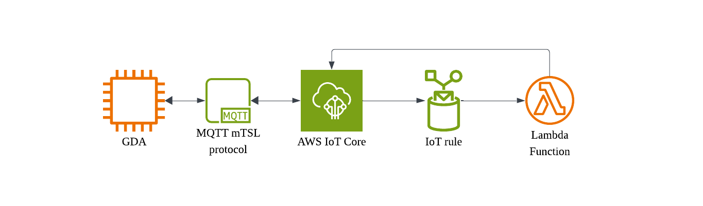

# Cloud Service Functions (Connected Devices)

## Lab Module 11

These optional components may be included in your assignment, but are not required. If you choose to implement them, be sure to complete this README and review all the PIOT-CSF-\* issues (requirements) listed at [PIOT-INF-11-001 - Lab Module 11](https://github.com/orgs/programming-the-iot/projects/1#column-10488514).

### Description

NOTE: Include two full paragraphs describing your implementation approach by answering the questions listed below.

What does your implementation do?
I create an AWS IoT core resource connecting my GDA "Thing" through MQTT, IoT core receives sensor data published by the GDA and evaluates the data against self-defined thresholds to generate actuator commands that are sent back to the GDA through IoT Core.

How does your implementation work?

The IoT Rules Engine listens on the GDA's sensor MQTT topic using a SQL filter and triggers a Lambda function when a message arrives. Then, the Lambda parses the sensor payload and if the value exceeds a threshold publishes an ActuatorData JSON command to an actuator topic on AWS IoT Core, which delivers it back to the GDA over the same mTLS MQTT connection.

### High-Level Design Diagram

Include a simple box diagram that represents your cloud services functionality. It only has to include the cloud-specific components.

### Code Documentation (only applies if you wrote CSF-specific code, otherwise, ignore)

#### Code Repository and Branch

NOTE: Be sure to include the branch (e.g. https://github.com/programming-the-iot/python-components/tree/alpha001).

URL:

#### UML Design Diagram(s)

NOTE: Include one or more UML designs representing your solution. It's expected each
diagram you provide will look similar to, but not the same as, its counterpart in the
book [Programming the IoT](https://learning.oreilly.com/library/view/programming-the-internet/9781492081401/).

#### Unit Tests Executed

NOTE: TA's will execute your unit tests. You only need to list each test case below
(e.g. ConfigUtilTest, DataUtilTest, etc). Be sure to include all previous tests, too,
since you need to ensure you haven't introduced regressions.

-
-
-

#### Integration Tests Executed

NOTE: TA's will execute most of your integration tests using their own environment, with
some exceptions (such as your cloud connectivity tests). In such cases, they'll review
your code to ensure it's correct. As for the tests you execute, you only need to list each
test case below (e.g. SensorSimAdapterManagerTest, DeviceDataManagerTest, etc.)

-
-
-

EOF.
