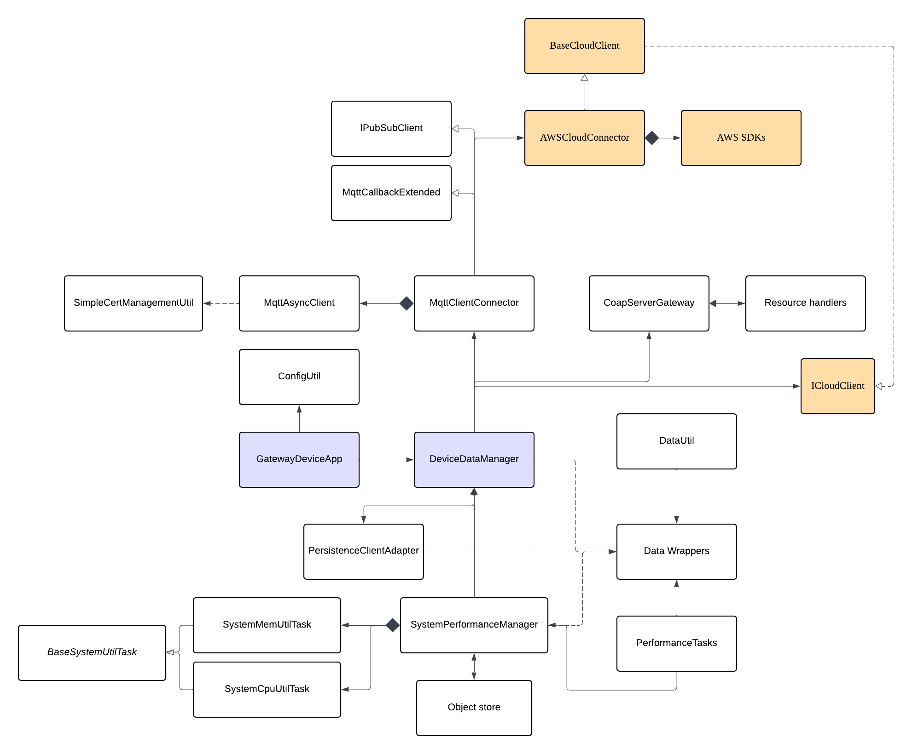

# Gateway Device Application (Connected Devices)

## Lab Module 11

Be sure to implement all the PIOT-GDA-\* issues (requirements) listed at [PIOT-INF-11-001 - Lab Module 11](https://github.com/orgs/programming-the-iot/projects/1#column-10488514).

### Description

NOTE: Include two full paragraphs describing your implementation approach by answering the questions listed below.

What does your implementation do?

In this module, my GDA connects to AWS IoT Core as a cloud MQTT client, publishes sensor data to the cloud, and subscribes to an actuator topic to receive and process commands generated by the Lambda function.

How does your implementation work?

The CloudClientConnector wraps the MqttClientConnector configured with mTLS credentials, in order to use mTLS to communicate, GDA needs: device certificate, private key, and Amazon root CA to establish a secure connection to AWS IoT Core. The DeviceDataManager forwards SensorData to this connector which serializes it via DataUtil and publishes it, while simultaneously a subscription callback receives actuator commands, deserializes them into ActuatorData objects, and routes them to the appropriate handler for execution.

### Code Repository and Branch

NOTE: Be sure to include the branch (e.g. https://github.com/programming-the-iot/python-components/tree/alpha001).

URL: https://github.com/TELE6530-spring2026-WEICHENG/gda-java-components/tree/lab11

### UML Design Diagram(s)

NOTE: Include one or more UML designs representing your solution. It's expected each
diagram you provide will look similar to, but not the same as, its counterpart in the
book [Programming the IoT](https://learning.oreilly.com/library/view/programming-the-internet/9781492081401/).

### Unit Tests Executed

NOTE: TA's will execute your unit tests. You only need to list each test case below
(e.g. ConfigUtilTest, DataUtilTest, etc). Be sure to include all previous tests, too,
since you need to ensure you haven't introduced regressions.

- ConfigUtilDefaultTest
- ConfigUtilCustomTest
- SystemCpuUtilTaskTest
- SystemMemUtilTaskTest
- ActuatorDataTest
- SensorDataTest
- SystemPerformanceDataTest

### Integration Tests Executed

NOTE: TA's will execute most of your integration tests using their own environment, with
some exceptions (such as your cloud connectivity tests). In such cases, they'll review
your code to ensure it's correct. As for the tests you execute, you only need to list each
test case below (e.g. SensorSimAdapterManagerTest, DeviceDataManagerTest, etc.)

- SystemPerformanceManagerTest
- GatewayDeviceAppTest
- SystemPerformanceManagerTest
- DataIntegrationTest
- DeviceDataManagerNoCommsTest
- GatewayDeviceAppTest
- testConnectAndDisconnect() in MqttClientConnectorTest
- testPublishAndSubscribe() in MqttClientConnectorTest
- MqttClientControlPacketTest
- Publish and subscribe integration test - using two terminal
- CoapServerGatewayTest
- CoapClientToServerConnectorTest - testSystemPerformancePutMessage()
- MqttClientConnectorTest
- MqttClientConnectorTest testActuatorCommandResponseSubscription()
- MqttClientConnectorTest testSendActuationEventsToCda()

---

- MqttClientConnectorTest
- TimeAndValuePayloadDataTest
- CloudClientConnectorTest-testCloudClientConnectAndDisconnect(), testIntegratedCloudClientConnectAndDisconnect(), testPublishAndSubscribe()

EOF.
