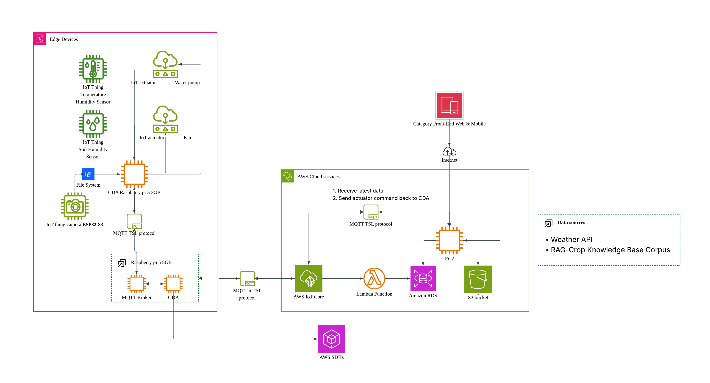

# Lab Module 12 - Semester Project Proposal

## Description

This project builds a Smart Home Gardening System that turns my personal plant-care routine into a data-driven, edge-to-cloud IoT loop. A Raspberry Pi 5 CDA collects temperature, humidity, and soil moisture readings alongside ESP32-S3 leaf images, publishes them over MQTT/TLS to a local broker co-located with the GDA, which then forwards the data to AWS IoT Core via mTLS. A Lambda function persists telemetry in RDS and S3, while an EC2-hosted AI service fuses live sensors with weather forecasts and a RAG crop knowledge base to automate ventilation and recommend watering decisions back to me.

## What - The Problem

Keeping plants healthy at home takes a surprising amount of daily effort — checking soil moisture by hand, judging whether the greenhouse is too hot, and remembering each crop's specific needs. A single missed watering or a late reaction to a heatwave can undo weeks of growth, and most hobby gardeners (myself included) end up relying on intuition like "it looks dry today" rather than real data.

This matters because the gap between sensing and deciding is exactly where plants suffer. Cheap sensors exist, and cloud AI exists, but they are rarely tied together into a loop that a single gardener can actually use. Closing that gap would let me — and anyone with a similar hobby — spend less time on manual checks while still giving each plant the care it specifically needs.

## Why - Who Cares?

Why do you care about this particular problem? Write 1 to 2 paragraphs in response.

I care about this problem because gardening and plant cultivation is my personal hobby. Anyone who has kept plants knows how much time it takes to check soil moisture every day, judge whether the greenhouse is too hot, and remember each crop's specific needs — and a single missed watering or late reaction to a heatwave can undo weeks of work. I want to build a system that frees me from that constant manual checking while still keeping my plants healthier than I could by hand.

More importantly, I want my gardening decisions to be data-driven rather than intuition-driven. Instead of guessing "it looks dry today," the system will combine real soil moisture readings, local weather forecasts, and crop-specific knowledge from the RAG corpus to decide exactly when and how much to irrigate or ventilate. The expected payoff is concrete: lower time cost for me as the caretaker, and measurably better growth outcomes for the crops because every action is backed by evidence rather than habit.

## How - Expected Technical Approach

How do you plan to tackle this problem technically?

Include a high-level design diagram depicting your planned technical approach - it does not need to be final, but it must include the CDA, GDA, and cloud services you plan to use, as well as the protocol(s) you will use for communicating between the devices and the cloud.

Write 1 to 2 paragraphs describing your diagram.

**_Edge tier_**

A Raspberry Pi 5 2GB CDA reads a DHT22 (temp/humidity) and a capacitive soil moisture sensor, drives a water pump and fan as actuators, and receives image frames from an ESP32-S3 camera. It publishes SensorData and SystemPerformanceData JSON on MQTT topics over TLS to a Mosquitto broker on Raspberry Pi 5 8GB, which also hosts the Java GDA.

**_Gateway tier_**

The GDA (this repo) consumes CDA telemetry through its MqttClientConnector, applies local filtering/aggregation in DeviceDataManager, and forwards upstream through CloudClientConnector using mTLS to AWS IoT Core — validating AmazonRootCA1.pem while presenting the device certificate and private key registered as a Thing. Actuator commands flow back on the reverse topic and are dispatched to the CDA via the local broker.

**_Cloud tier_**

An AWS IoT Rule routes inbound messages to a Lambda function that persists structured telemetry in Amazon RDS and image blobs in S3. An EC2 instance runs the decision engine: it queries RDS for the latest state, calls a Weather API, retrieves crop-care context from a RAG knowledge corpus, and runs lightweight image recognition on leaf photos. Resulting ActuatorData commands are re-published to IoT Core and delivered back down to the CDA.

## Results - Expected Outcomes

If everything works, the system will run as a hybrid autonomous + advisory loop.
The fan is fully automatic, when temperature or humidity crosses the AI's crop-specific thresholds, the GDA sends an ActuatorData command and the CDA turns it on with no human involvement.
Irrigation stays advisory. AI combines soil moisture, weather forecasts, and the RAG crop knowledge base to push a watering recommendation to the app/email/slack for me to confirm, keeping a human in the loop for the higher-stakes action.

EOF.
